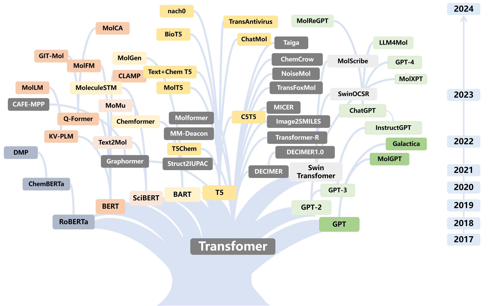
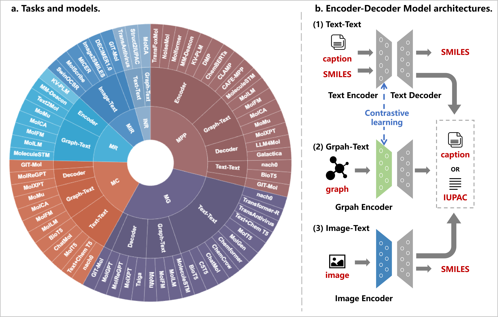
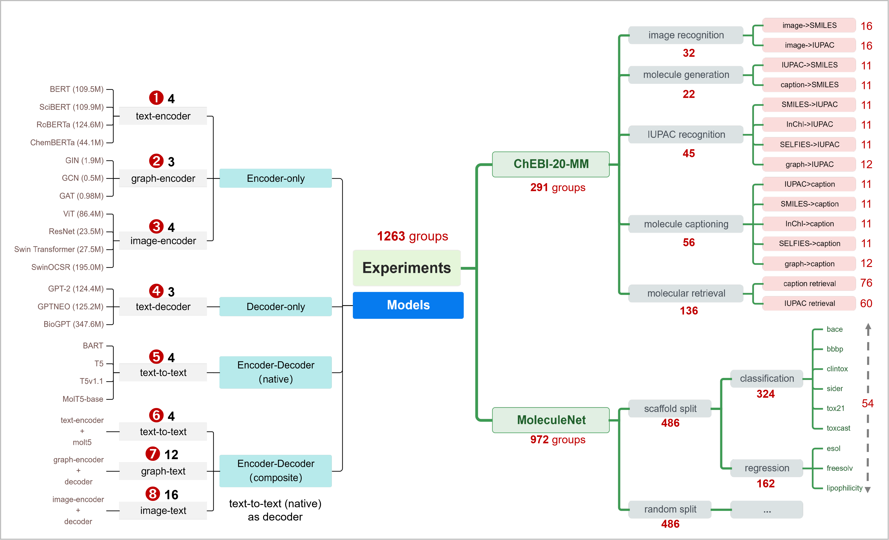

# LLM4Mol
[](https://arxiv.org/abs/2308.06911) 

Here, we address the gap in a comprehensive review of Transformer models and LLMs for molecular modeling and design, specifically in molecular recognition, generation, optimization, captioning, and property prediction. Moreover, this work reviews the models and creates a unified benchmark ChEBI-20-MM to conduct 1263 experiments to identify the key factors influencing the performance of these models. Finally, our review explores an end-to-end visual analysis, uncovering models' chemical intuition.
</br>
</br>

</br>
</br>
**The paradigm of the review**. **a. Molecular modeling and design tasks**, showcasing six task types with their standard modeling methods and data examples. **b. The processes of tasks**, we divide common molecular data into two categories: internal and external information. Internal information, integral to molecular representation, can be converted through various tools. External information is more accessible to human understanding. Additionally, this part highlights the research scope of our review, detailing the input and output for each task.

**Note:** The sections on the ChEBI-20-MM benchmark and Models below describe the contents of the respective directories. Due to size constraints and permissions, some data and ckpts may not be uploaded.

## ChEBI-20-MM
**We introduce ChEBI-20-MM, a benchmark developed from the ChEBI-20 dataset, integrating multi-modal data such as InChI, IUPAC, and images.**

This folder contains the data for finetuning models with Data of SMILES string, IUPAC name, InChI, SELFIES, and caption modalities.
- train.csv --26,406 No.
- validation.csv --3,300 No.
- test.csv --3,300 No.
`image` - Molecular images of ChEBI-20 from Pubchem
- cid.png

The ChEBI-20-MM and MoleculeNet can be downloaded from the following links:
- [ChEBI-20-MM](https://huggingface.co/datasets/liupf/ChEBI-20-MM)
- [MoleculeNet Datasets](https://moleculenet.org/datasets-1)

## Review of Models
### The developments of Models
The timeline of the key developments of transformer-based models.
</br>
</br>

</br>
</br>

### Category and Architectures of Models
\textbf{An overview of category and architectures of models in molecular modeling and design.} \textbf{a.tasks and models}, clarifies the relationship between six downstream tasks and model architectures.
\textbf{b. Encoder-Decoder Model Architectures}, delineating three main frameworks: (1) \textbf{Text-Text} primarily focused on text translation tasks;
(2) \textbf{Graph-Text}, predominantly used in contrastive learning frameworks and serving as an encoder for downstream tasks;
(3) \textbf{Image-Text}, chiefly applied in Molecular Image Recognition tasks.
</br>
</br>

</br>
</br>

## Evaluation Framework
\textbf{Benchmark Experiments Overview.}
Our study encompasses tests across eight primary model architectures, each featuring 3-4 common backbone models or composite models within its category.
The figure annotates the base model parameter size for clarity. In total, \textbf{1263} experimental setups were conducted, demonstrating the adaptability of various model architectures to different task types.
</br>
</br>

</br>
</br>
- `ckpts` - This folder contains checkpoints for finetuning
    - image_ckpts
        - [Swin Transformer-SwinOCSR](https://github.com/suanfaxiaohuo/SwinOCSR)
        - [Swin Transformer](https://github.com/suanfaxiaohuo/SwinOCSR)
        - [ResNet](https://huggingface.co/microsoft/swin-base-patch4-window7-224-in22k)
        - [ViT](https://huggingface.co/google/vit-base-patch16-224)
    - text_ckpts
        - Encoder-only
            - [SciBERT](https://huggingface.co/allenai/scibert_scivocab_uncased)
            - []
            - []
            - []
        - Decoder-only
            - []
            - []
            - []
            - []
        - Encoder-Decoder
            - [BART]
            - [T5]
            - [T511]
            - [MolT5-base](https://huggingface.co/laituan245/molt5-base)
- `datasets`
    - ChEBI-20-MM - Multi-modal molecular benchmark
    - mpp - MoleculeNet benchmark
- `src`
    - `evaluations`
        - fingerprint_metrics.py
        - text_translation_metrics.py
        - mol_translation_metrics.py
    - `feature` -Embedding methods
        - base_featurizer.py
        - graph_featurizer.py - Graph embedding
    - `models`
        -'molecule' - Models of single-modal
        -'multimodal' - Models of multi-modal
        - metric.py - Metric loading
        - __init__.py - Model initialization
        - model_manager.py - Model loading
    - `utils`
        - __init__.py - Common tool initialization
        - xutils.py - Special tool initialization
    - `tasks`
        - dataset_manager.py - Code of ChEBI-20-MM dataloader
        - task_manager.py - Code of text generation tasks
        - mol_retrieval.py - Code of retrieval task
        - MoleculeNet_loader.py - Code of MoleculeNet dataloader
        - splitters.py - Code of data splitting
        - MPP.py - Code of molecular property predictions

**Below are the specific parameter explanations for tasks:**
### property_prediction -- finetune.py 
- `--modals`  
  Modalities used in this task contain graph2d, SMILES, or both.

- `--pool`  
  Type: `str`  
  Default: `avg`  
  Pooling function of text and graph embeddings. Options: Avg or Max.

- `--fusion_mode`  
  Type: `str`  
  Default: `attention`  
  If we use graph2d and SMILES modalities in this task, we can choose the fusion mode of the two embeddings. Options: Attention or Weights.

## References
```
[1]: Xu Z, Li J, Yang Z, et al. SwinOCSR: end-to-end optical chemical structure recognition using a Swin Transformer[J]. Journal of Cheminformatics, 2022, 14(1): 1-13.
[2]: Su B, Du D, Yang Z, et al. A molecular multimodal foundation model associating molecule graphs with natural language[J]. arXiv preprint arXiv:2209.05481, 2022.(https://arxiv.org/abs/2209.05481)
[3]: Edwards C, Lai T, Ros K, et al. Translation between molecules and natural language[J]. arXiv preprint arXiv:2204.11817, 2022.
[4]: Beltagy I, Lo K, Cohan A. SciBERT: A pretrained language model for scientific text[J]. arXiv preprint arXiv:1903.10676, 2019.
[5]: Li J, Li D, Savarese S, et al. Blip-2: Bootstrapping language-image pre-training with frozen image encoders and large language models[J]. arXiv preprint arXiv:2301.12597, 2023.
```
## Citation
```
@misc{liu2023gitmol,
      title={GIT-Mol: A Multi-modal Large Language Model for Molecular Science with Graph, Image, and Text}, 
      author={Pengfei Liu and Yiming Ren and Zhixiang Ren},
      year={2023},
      eprint={2308.06911},
      archivePrefix={arXiv},
      primaryClass={cs.LG}
}
```
